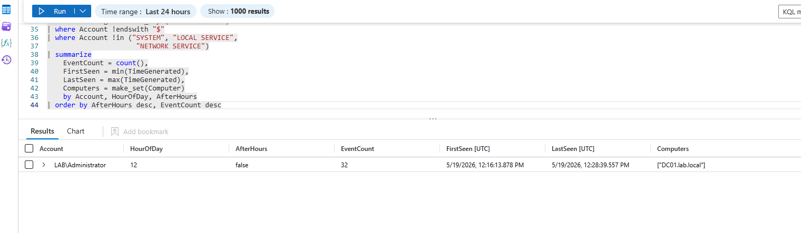

# privileged-logon-anomaly

# Privileged Account Logon Anomaly Detection
**MITRE ATT&CK:** T1078.002 - Valid Accounts: Domain Accounts
**Log Source:** Windows Security Events via AMA → Sentinel
**Event IDs:** 4672 - Special Privileges Assigned |
4624 - Successful Logon

## Overview
4672 events are everywhere in Active Directory — every 
admin logon generates one. By itself it tells you nothing 
useful. But when you correlate it with how someone logged 
on and what time they did it, the noise becomes signal.

This detection joins privilege assignment events with 
logon context to catch what matters — admin accounts 
authenticating via RDP outside business hours. That's 
the pattern you see after credentials get stolen. The 
attacker has valid creds, they're in, and without this 
correlation they're invisible in the logs.

## Attack Scenario
Attacker obtains domain admin credentials via phishing, 
Kerberoasting, or Pass-the-Hash. They authenticate via 
RDP at 2am. Without this detection the event is one row 
in millions. With it — the alert fires immediately.

## Detection Logic
- Join 4672 with 4624 on account identity
- Filter for RDP (LogonType 10) and Network (LogonType 3)
- Calculate hour of day from timestamp
- Flag authentications outside 07:00-19:00 window
- Exclude computer accounts and built-in service accounts
- Deduplicate via time bucketing — one row per account

## Logon Types — Reference
| Type | Description | Risk |
|------|-------------|------|
| 2 | Interactive — physically at keyboard | Low |
| 3 | Network — share or drive mapping | Medium |
| 10 | RemoteInteractive — RDP session | High |
| 5 | Service account logon | Expected |

## KQL Detection Rule
```kql
let BizStart = 7;
let BizEnd = 19;
SecurityEvent
| where EventID == 4672
| join kind=inner (
    SecurityEvent
    | where EventID == 4624
    | where LogonType in (10, 3)
    | project
        TimeGenerated,
        Account,
        LogonType,
        IpAddress,
        LogonTypeName = case(
            LogonType == 10, "RemoteInteractive (RDP)",
            LogonType == 3, "Network",
            "Other")
) on Account
| extend HourOfDay = hourofday(TimeGenerated)
| extend AfterHours = iff(
    HourOfDay < BizStart or
    HourOfDay >= BizEnd, true, false)
| where AfterHours == true
| where Account !endswith "$"
| where Account !in ("SYSTEM", "LOCAL SERVICE",
                      "NETWORK SERVICE")
| summarize
    EventCount = count(),
    FirstSeen = min(TimeGenerated),
    LastSeen = max(TimeGenerated),
    Computers = make_set(Computer)
    by Account, HourOfDay, AfterHours
| order by AfterHours desc, EventCount desc
```

## Validation Results
Rule executed against live Sentinel data from DC01.lab.local. 
Returned single deduplicated row for LAB\Administrator 
during business hours — correctly assessed AfterHours = false. 
No false positives generated during tuning. Rule confirmed 
functional against real production telemetry.

## Evidence

**Sentinel Detection Output — Single Deduplicated Row**


## So What
A domain admin account authenticating via RDP outside 
business hours is one of the highest-confidence indicators 
of credential compromise in any environment. This rule 
fires before the attacker reaches their objective — giving 
the SOC a response window that endpoint-only detections 
miss entirely.

## Identity & Trust Context
This detection catches trust boundary violations at the 
domain identity layer. An attacker using valid stolen 
credentials bypasses every perimeter control — this rule 
catches them at the authentication event itself, regardless 
of how they obtained the credentials. Every privileged 
logon is a trust decision — this rule audits every one.

## False Positive Considerations
- Legitimate after-hours admin work — validate with 
  the account owner
- Automated scripts running as admin accounts — 
  move to service accounts with scoped permissions
- Global teams across time zones — adjust BizStart 
  and BizEnd variables to match operational hours

## Environment
- Log source: DC01.lab.local Windows Security Events
- Pipeline: AMA → Azure Arc → DCR → DetectionLab-LAW → Sentinel
- Validated against live production telemetry
- Lab: Isolated HyperV environment
